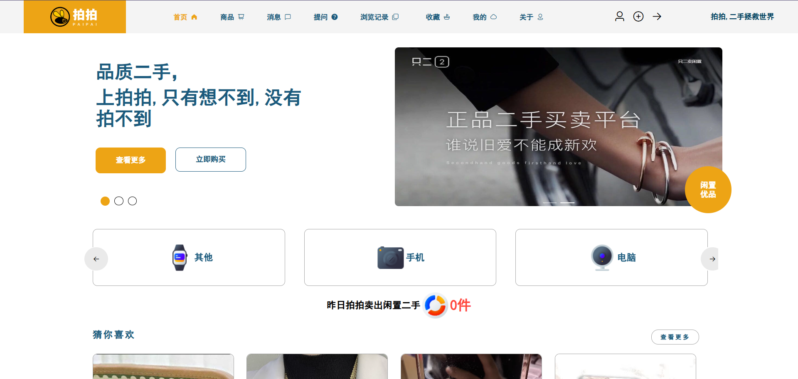

# 基于SpringBoot+Vue的二手物品交易网站的设计与实现

 **功能：** 
 **有不会的或者不懂的都可以QQ1760272627交流一下。** 
 **系统的二个主要模块：** 

 **用户：** 

登录、注册、忘记密码、主页、猜你喜欢、商品列表、下单、在线咨询卖家、商品提问、商品收藏、浏览记录、黑名单、关注卖家、地址管理、个人中心、我的、评论、投诉、订单列表、商品管理等功能

 **管理员：** 

首页、商品管理、订单管理、商品类型管理、城市管理、省份咨询、轮播图管理管理、投诉管理、用户管理、管理员管理、个人中心、系统设置

 **系统截图：** 

 **采用技术：** SpringBoot，Mybatis-plus，Vue，redis，mysql，ElementUi 

 **工具：** idea，vscode，navicat

 **有不会的或者不懂的都可以QQ1760272627交流一下。** 